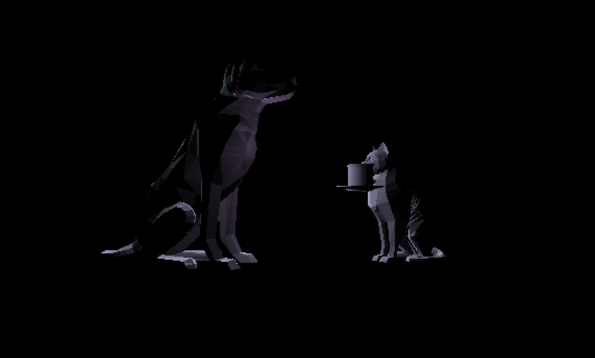

# CMPM-163
Git repository for CMPM 163 at UCSC.

Lab 2 - https://drive.google.com/file/d/1cpRHiODJSGLHp9TaBB26he9fIgDrrXmb/view?usp=sharing

Lab 3 - https://drive.google.com/open?id=1qaqewG9cD1PKVh7JALFky76aXBXGuTAe
The cube furthest to the left has a dark grey color with a phong shader using a purple specular highlight (0xccaaee)
The second farthest left cube is similar, it has a slightly brighter base color, and uses toon shading instead. It's specular highlight is bright blue (0xcaefff)
The two cubes on the far right are using fragment shaders.
  - the one on top is my shader, it hard cuts between different colors depending on the position of the pixel, it's decided by a chain of ifs.
  - the one on the bottom is using the shader from the tutorial, I only changed the colors

Lab 4 - https://drive.google.com/open?id=1w--Ka9igTD6xp0TjlD2WUenKjspdIffD
Video: bottom row is part 1, top two are part 2, the cube on the top left is tiled
Part 1:
  What is a formula to get the x coordinate of the texture given a u value of the uv coordinate (a value between 0 and 1)?
  
  xMax = maximum value for x
  
  u * xMax = x coordinate
  
  What is a formula to get the y coordinate of the texture given a v value of the uv coordinate (a value between 0 and 1)?
  
  yMax = maximum value for y
  
  u * yMax = y coordinate
  
  What color is sampled from the texture at the uv coordinate (0.375, 0.25)?
  
  The color is white
