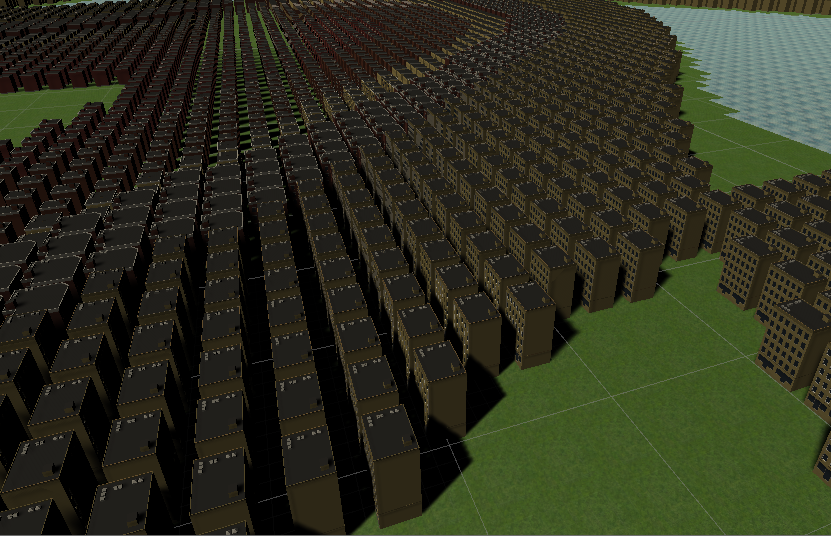

# CMPM-163
Git repository for CMPM 163 at UCSC.

# Lab 2 - https://drive.google.com/file/d/1cpRHiODJSGLHp9TaBB26he9fIgDrrXmb/view?usp=sharing

# Lab 3 - https://drive.google.com/open?id=1qaqewG9cD1PKVh7JALFky76aXBXGuTAe
The cube furthest to the left has a dark grey color with a phong shader using a purple specular highlight (0xccaaee)
The second farthest left cube is similar, it has a slightly brighter base color, and uses toon shading instead. It's specular highlight is bright blue (0xcaefff)
The two cubes on the far right are using fragment shaders.
  - the one on top is my shader, it hard cuts between different colors depending on the position of the pixel, it's decided by a chain of ifs.
  - the one on the bottom is using the shader from the tutorial, I only changed the colors

# Lab 4 - https://drive.google.com/open?id=1w--Ka9igTD6xp0TjlD2WUenKjspdIffD

Video: bottom row is part 1, top two are part 2, the cube on the top left is tiled

Part 1:
  What is a formula to get the x coordinate of the texture given a u value of the uv coordinate (a value between 0 and 1)?
  
  xMax = maximum value for x
  
  u * xMax = x coordinate
  
  What is a formula to get the y coordinate of the texture given a v value of the uv coordinate (a value between 0 and 1)?
  
  yMax = maximum value for y
  
  u * yMax = y coordinate
  
  What color is sampled from the texture at the uv coordinate (0.375, 0.25)?
  
  The color is white

Part 2:
This code makes a new vec2 that will sample the whole texture over uv values (0,0) to (0.5,0.5), then start over thus tiling. I use tiledUv instead of vUv.
vec2 tiledUv;
	tiledUv.x = mod(vUv.x, 0.5) * 2.0;
	tiledUv.y = mod(vUv.y, 0.5) * 2.0;
	
# Lab 5 - https://drive.google.com/open?id=1uzfL847hvurWRQMt5TgZgROr39hJ947u
The particle is very similar to the one from the tutorial, the color is changed but the sprite is the same, only some minor tweaks otherwise. I added four boxes around the track that when entered, rotates the sun around the map, and rotates the directional light, it's a little buggy, I'm still learning about quaternions as rotation. Lastly I tweaked the material for the sun by swapping the albedo for an emmision texture, I think it works pretty well.

# Lab 6 

A directional light behaves like the sun, it shines on everything no matter where it is, the angle that it shines can be changed.

A spot light points like a flashlight, it shines in a direction from a point, the angle of its cone of light can be changed. the one in my scene is green, and moves.

A point light behaves like a lightbulb, it shines in all directions from its position. Mine is in the top right of the scene, it's blue

An area light is confusing, it shines from an area, only works with baked lighting, and requires light probes, in my scene the area light behaves weird, it is on the floor in the corner, its color is blue.

I made a texture to mimic my housemate's waterbottle (I don't know how to shrink the image, sorry!)  

I got the image textures from here - opengameart.org. I used marble and stacked stone.

My skybox uses Unity's procedural skybox, I changed the colors of the atmosphere and ground, and removed the sun.

# Lab 7 - https://drive.google.com/open?id=1L2Q0ZW_oHPK8av0JoE9x2RErfeUkle9j
I did part 1. I didn't work with my partner, they made a mountain-island with a river and some trees, their mountain looks like one tall spire.

My scene has a mountain range with lakes, and a wiggling ball.

The mountain was made with the mountain shadergraph from the tutorial, I cubed the noise to make it steeper, though a plane with more verticies would've probably looked better. I also added a green-grey gradient that changes with the vertex's y coordinate

The waves are using the wave shader code.

The wiggling ball was made with a shader graph I made based off of the mountain graph. Originally it was meant to make waves. I used voronoi noise and scrolled it across the ball. The same could be done to a plane to make waves, but I changed the sun a bit so it was not moving in waves across one axis. I put a point light inside of it that is a similar color.

The skybox was a unity procedural skybox.

# Lab 8 
 
My city uses the same assets from the tutorial, and I found a grass and water texture online. New York is densley packed and the tutorial made something dense. I tried to make the water use my water shader from Lab 7 and add motion, but I couldn't get it to work. I kinda didn't know what to do for this project.

# Lab 9

I made my L-System from the tutorial, he had a problem that the angle wasn't working so I tried making it negative and that worked. I wanted the line so slowly draw itself and not pop in at all, my logic for that is in lines 90-100.
